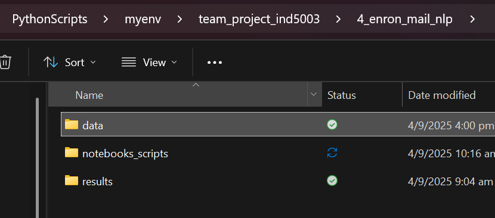

# team_project_ind5003

## 1. Environment set-up
Create a virtual environment and pip install packages specified in requirement.txt file

## 2. Folder Stucture example per topic

    1. Add this folder structure (data, notebooks_scripts, results) if cloning don't create them

    2. Place enron tar dataset you downloaded from https://www.cs.cmu.edu/~enron/enron_mail_20150507.tar.gz --> \data

## 3. Enron Scandal Key Timeline (We form our ideas based on this timeline VS our EDA)

    The key timeline of the Enron scandal begins with its 1985 formation, the introduction of Jeffrey Skilling in 1990 who eventually became CEO, and their use of fraudulent accounting to hide debt and inflate earnings. The downfall accelerated in late 2001, with Skilling's resignation, Sherron Watkins's warning to CEO Kenneth Lay, a major third-quarter loss announcement, and a formal SEC investigation. On December 2, 2001, Enron filed for bankruptcy, followed by the collapse of its auditor, Arthur Andersen, in 2002, and the criminal convictions of Lay and Skilling for their roles in the massive fraud. 

    Pre-Scandal & Early Years (1985-2000)
    1985:
    Houston Natural Gas merges with InterNorth, forming Enron. 
    1990:
    Jeffrey Skilling is hired to run a new subsidiary, and later Andrew S. Fastow joins the company. 
    1990s:
    Enron shifts from being a pipeline company to a trading company, employing aggressive accounting methods to hide debt and inflate profits through special partnerships (Special Purpose Entities).

    2000 (Aug.):
    Enron's stock reaches an all-time high of $90.56, and Skilling is named CEO to take over from Kenneth Lay in 2001. 

    The Collapse (2001)
    Feb. 12, 2001: Skilling becomes CEO, with Lay remaining chairman. 
    Aug. 14, 2001: Skilling resigns abruptly, and Lay resumes the CEO position. 
    Aug. 15, 2001: Vice President Sherron Watkins warns Lay that Enron is headed for "implosion" due to accounting problems. 
    Oct. 16, 2001: Enron announces a $618 million third-quarter loss. 
    Oct. 31, 2001: The company discloses it is under formal investigation by the Securities and Exchange Commission (SEC). 
    Nov. 9, 2001: Enron's proposed sale to rival Dynegy falls through. 
    Dec. 2, 2001: Enron files for Chapter 11 bankruptcy protection, the largest corporate bankruptcy in U.S. history at the time. 
    Aftermath & Consequences (2002-2006)
    Jan. 10, 2002:
    Arthur Andersen, Enron's auditor, discloses that its employees destroyed Enron-related documents. 
    Feb. 2002:
    Arthur Andersen is convicted of obstruction of justice, leading to its eventual demise. 
    Jan. 2002:
    The FBI begins its criminal investigation, executing a search of Enron's headquarters. 
    2006:
    Lay and Skilling are convicted of multiple counts of fraud and conspiracy. Lay dies before he can be sentenced. 